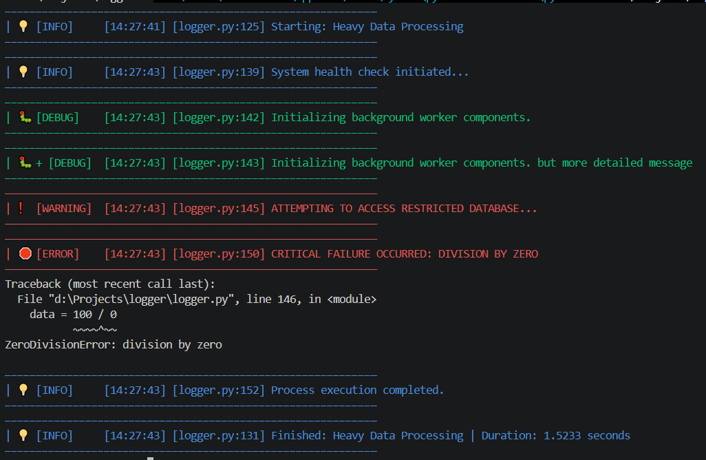

# PyLogger

A lightweight, high-performance, and thread-safe logging utility for Python. It provides beautiful console output, automatic file persistence, and robust context management to ensure your logs are always captured correctly.

## Features

* **Context Managed**: Automatically handles file opening/closing using the `with` statement.
* **Thread-Safe**: Designed to prevent file corruption in concurrent environments.
* **Automatic Cleanup**: Built-in rotation policy to delete logs older than a specified number of days.
* **Structured Levels**: Supports `DEBUG`, `INFO`, `WARNING`, and `ERROR` levels with color-coded terminal output.
* **Exception Tracking**: Automatically captures and logs full stack traces during exceptions.
* **Performance Timing**: Includes a Timer context manager to easily measure and log the execution time of code blocks.
* **Dynamic Location Tracking:** Automatically logs the `filename`, `line number`, and `function name` where the log was triggered.

## Installation

This project relies on `colorama` for cross-platform terminal colors. You can install it via pip:

```bash
pip install colorama

```

## Example Usage

Wrap your application logic in a `with` block to ensure all resources are cleaned up safely, even if the program crashes.

```python
from logger import Logger

# Initialize with desired configuration
# Using the 'with' statement ensures the file closes automatically
with Logger(min_level=LogLevel.DEBUG_P, colors=True, frame=60, version='test_advance', save=True) as log:
        with Timer(log, "Heavy Data Processing"):
            time.sleep(1.5)

            log.info("System health check initiated...")
            
            # Example of a debug message (only shows if version='test' or 'test_advance'  or debug mode is True)
            log.debug("Initializing background worker components.")
            log.debug_p("Initializing background worker components. but more detailed message")
            try:
                log.warning("Attempting to access restricted database...")
                data = 100 / 0
                
            except Exception as e:
                # This logs the specific error + captures the full traceback automatically
                log.error(f"Critical failure occurred: {e}")

            log.info("Process execution completed.")
        

# The log file is automatically closed here

```


### Custom Formatting

You can define your own log structure using available keys: `timestamp`, `location`, `function`, `message`, and `prefix`.

```python
# Format: "Time: 12:00:00 | Function: main | MSG: Hello!"
custom_logger = Logger(log_format="Time: {timestamp} | Function: {function} | MSG: {message}")

```

## Configuration

You can customize the logger behavior during initialization:

| Parameter | Default | Description |
| --- | --- | --- |
| `colors` | `True` | Enables ANSI color output in the terminal. |
| `frame` | `50` | Sets the width of the visual decorative borders. |
| `version` | `'test'` | Toggles debug mode (`'full'` disables debug logs). |
| `save` | `False` | When `True`, saves logs to a timestamped file. |
| `min_level` | `0` | Minimum severity level required to print/log. |
| `days` | `7` | Duration to keep logs before auto-cleanup. |
| `log_format` | `'[{timestamp}] [{location}] {message}'` | Custom template for log structure. |

## License

This project is licensed under the MIT License - see the [LICENSE](LICENSE) file for details.